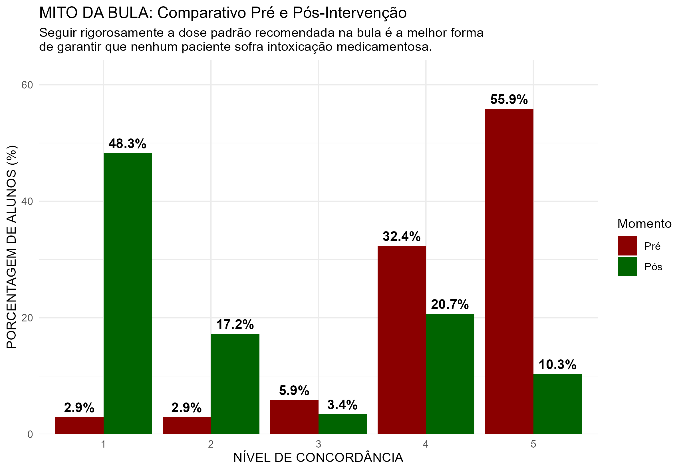
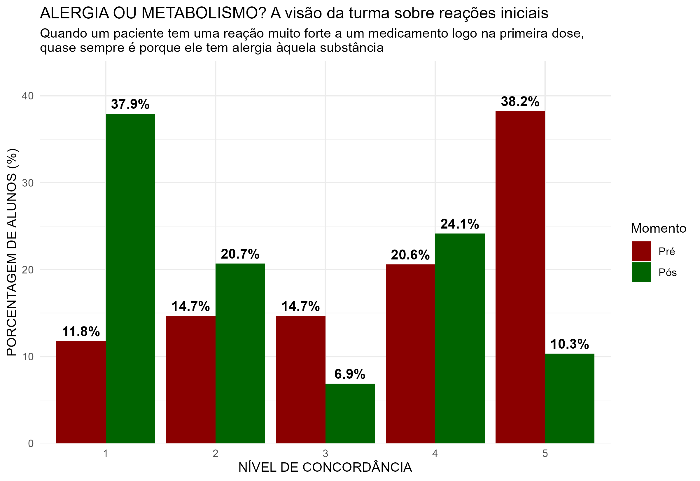
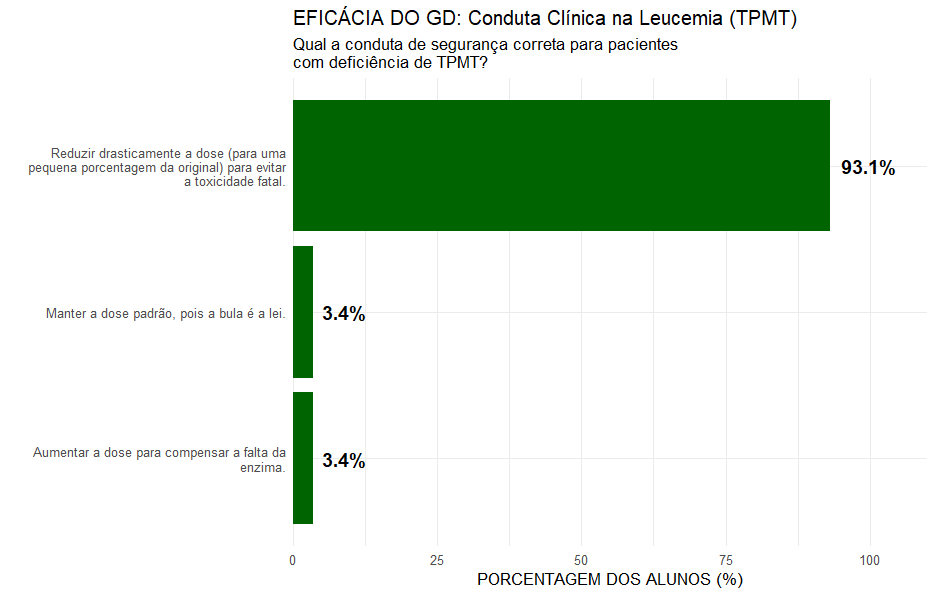
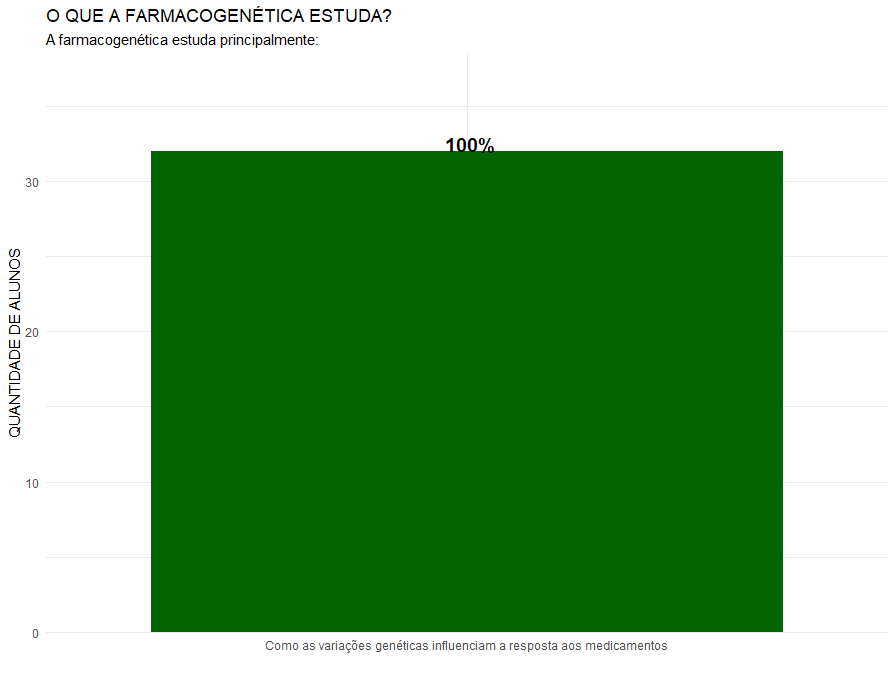
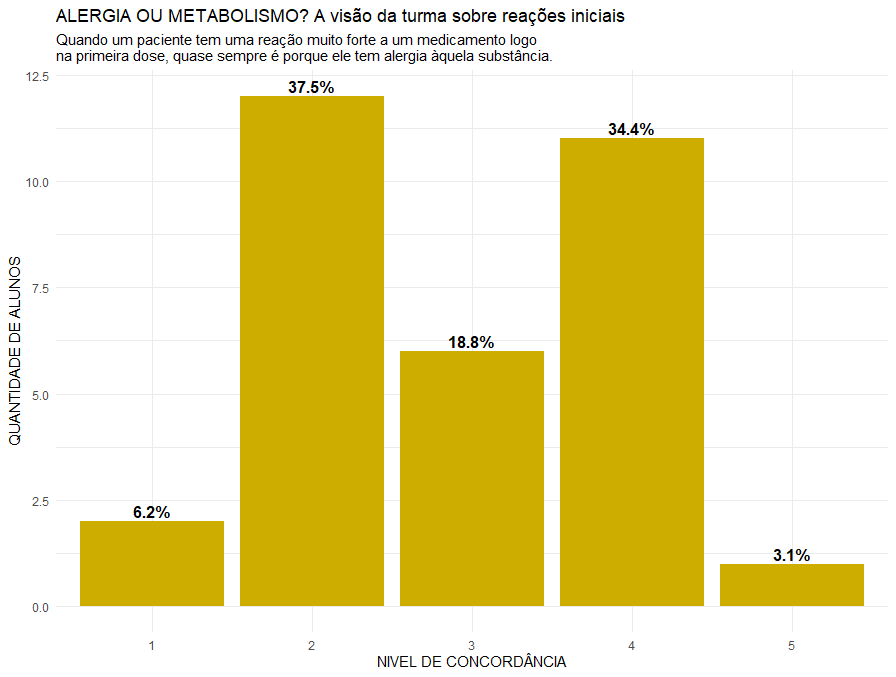
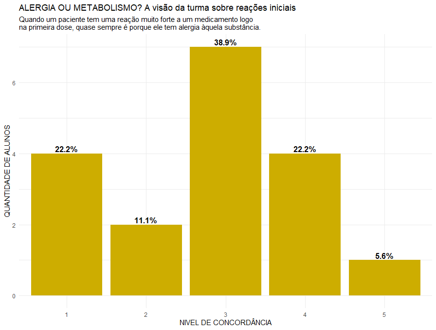

# Pharmacogenetics Health Education Analysis

> **Data-driven analysis of pharmacogenetics education impact. | Projeto de análise de dados e impacto educacional em farmacogenética para estudantes da área da saúde (UFMG).**

🇺🇸 *[Read this in English](README_EN.md)*

---

## ⌛ Status do Projeto
> **Enfermagem (2026/1) ✅**
> *Aplicação do questionário pré-intervenção, Grupo de Discussão (GD), coleta pós-intervenção e análise comparativa finalizadas com sucesso.*
>
> **Farmácia (2026/1) ⏳**
> *Coleta e análise da baseline (Pré-intervenção) concluídas. Aguardando aplicação da aula e coleta pós-intervenção.*
>
> **Biomedicina (2026/1) ⏳**
> *Coleta e análise da baseline (Pré-intervenção) concluídas. Aguardando definição da estratégia educacional e coleta pós-intervenção.*
---

Este projeto tem o objetivo de avaliar o conhecimento de estudantes da área da saúde sobre farmacogenética e medir o impacto de intervenções educativas baseadas em dados clínicos, utilizando uma abordagem estruturada de análise de dados e estatística descritiva.

## 📌 Objetivo
Identificar e analisar, por meio de dados, lacunas na formação acadêmica sobre genética e farmacogenética, avaliando quantitativamente se uma intervenção educacional melhora o entendimento dos estudantes sobre a segurança do paciente e a tomada de decisão clínica.

## ⚠️ O Problema (Baseado na Literatura Científica)
Estudos recentes apontam que a defasagem no ensino de medicina de precisão não é um problema isolado, mas uma falha sistêmica na formação de toda a equipe multidisciplinar de saúde. Enfermeiros, farmacêuticos e outros profissionais apresentam baixa confiança na interpretação de testes genéticos e na aplicação da farmacogenética na prática. A formação acadêmica tradicional ainda oferece pouca preparação para lidar com essas informações, o que impacta diretamente a prevenção de reações adversas e a segurança do paciente.

> *Fonte: Análise bibliográfica de 17 artigos científicos ([ver pasta /docs](./docs)).*

## 🏆 Principais Resultados (Data Insights - Fase 1: Enfermagem)
A extração e análise dos dados após a primeira intervenção educacional revelaram uma quebra clara de mitos do senso comum e alta retenção de condutas clínicas de segurança:

* **Quebra do Mito da Bula:** A concordância total de que "seguir rigorosamente a bula evita intoxicação" caiu drasticamente, dando lugar a uma discordância de **48.3%** no pós-intervenção.

* **Mudança de Paradigma (Alergia vs. Metabolismo):** A visão inicial de que reações severas na primeira dose são sempre "alergias" foi revertida, com a maioria da turma passando a discordar dessa premissa após a intervenção educacional.

* **Retenção Clínica Prática:** **100%** dos alunos identificaram corretamente o risco letal de overdose no caso prático de metabolismo ultrarrápido da Codeína (CYP2D6), e **93.1%** acertaram a conduta de redução drástica de dose no caso da TPMT.

  
  

### 📊 Resultados Preliminares (Baseline)
As turmas de Farmácia e Biomedicina apresentaram perfis distintos antes da intervenção educacional, revelando diferenças relevantes entre domínio conceitual e aplicação prática do conhecimento.

* **Farmácia:** Embora os estudantes dominem a teoria (100% de acerto no conceito), a turma se dividiu ao aplicar a prática clínica de Alergia vs. Metabolismo. Além disso, **65.2%** dos alunos demonstraram forte dependência do senso comum no "Mito da Bula".

  
  

* **Biomedicina:** Diante da dúvida clínica na questão de Alergia vs. Metabolismo, a maior parcela da turma de Biomedicina (**38.9%**) preferiu se resguardar no "Neutro" (Nível 3) a chutar uma resposta. O "Mito da Bula" ainda arrasta **55.6%** da turma para o erro.

  
  

## 🛠️ Tech Stack e Ferramentas
Este projeto utiliza programação estatística orientada a dados para extrair insights diretamente dos questionários:
* **Coleta de Dados:** Google Forms (Questionários estruturados com escala Likert).
* **Linguagem Principal:** `R`
* **Limpeza e Manipulação de Dados:** `dplyr` / `tidyr` (Pacote `tidyverse` para união de bases, renomeação de variáveis e fatoração).
* **Visualização de Dados:** `ggplot2` (Geração de gráficos comparativos estáticos com foco em *storytelling* em saúde e exportação automatizada via `ggsave` em 300 DPI).

## 📕 Metodologia
O projeto segue uma abordagem de análise de dados educacionais composta pelas etapas a seguir:
1. **Revisão Bibliográfica:** Análise de literatura científica para identificação de lacunas de conhecimento em genética e farmacogenética entre estudantes e profissionais da área da saúde.
2. **Coleta de Dados (Baseline):** Questionário estruturado antes da intervenção.
3. **Intervenção Educativa (Aula Teórica + GD):** Realização de uma aula expositiva ministrada pelo professor titular sobre os fundamentos da farmacogenética, seguida por um Grupo de Discussão (GD) ativo. O GD é focado na aplicação prática de casos clínicos reais.
4. **Coleta Pós-Intervenção:** Novo questionário para pareamento de respostas, aplicado após a intervenção educacional ser 100% concluída.
5. **Análise de Impacto:** Uso de script unificado em R para limpar, cruzar e gerar visualizações com a finalidade de avaliar mudanças no raciocínio clínico das turmas.

## 🧱 Estrutura do Repositório
* [**`/docs`**](./docs): Revisão bibliográfica, recortes de artigos e planejamento das intervenções.
* [**`/data`**](./data): Bases de dados anonimizadas em `.csv` separadas por curso.
* [**`/scripts`**](./scripts): Código completo em `R` contendo o pipeline unificado de ETL e geração de gráficos.
* [**`/plots`**](./plots): Gráficos exportados em alta resolução, organizados pelas fases da pesquisa.

## 🚀 Próximas Etapas

1. Iniciar a intervenção educacional na turma de Farmácia.
2. Realizar a coleta dos dados pós-intervenção educacional na turma de Farmácia.
3. Realizar a análise comparativa Pré vs. Pós da Farmácia utilizando o pipeline já desenvolvido.
4. Definir se vamos realizar uma intervenção educacional com a aplicação de Grupos de Discussão na Biomedicina, igual realizamos na Enfermagem e realizaremos na Farmácia. Ou se vamos deixar somente a aula sobre farmacogenética como "meio" de intervenção, permitindo uma análise específica sobre o impacto individual dos Grupos de Discussão no ganho de conhecimento dos alunos.
5. Finalizar a coleta da baseline da turma de Biomedicina.
6. Comparar os perfis educacionais entre Enfermagem, Farmácia e Biomedicina.

## ▶️ Como Executar a Análise
Este projeto foi desenvolvido de forma totalmente automatizada e estruturada. Para garantir que os caminhos relativos funcionem na sua máquina sem que você precise alterar nenhuma linha de código, siga o padrão profissional de execução de projetos em R:

### 1. Baixe o Projeto Completo
Em vez de baixar os arquivos soltos, baixe a estrutura completa do repositório para manter o pipeline intacto:
* Clique no botão verde **Code** no topo desta página e selecione **Download ZIP** (depois descompacte a pasta no seu computador).

### 2. Abra o Projeto no RStudio
Abra o seu RStudio. No menu superior, vá em File > New Project > Existing Directory.
Clique em Browse, navegue até a pasta do projeto que você baixou/descompactar e clique em Create Project.

### 3. Execute o Script de Forma Automatizada
Na aba de arquivos do RStudio, abra a pasta /scripts e selecione o arquivo correspondente ao curso que deseja analisar (ex: 03_pre_farmacia.R).
Certifique-se de que a respectiva base de dados .csv esteja dentro da pasta /data.

Pressione Ctrl + A para selecionar todo o código e clique em Run (ou use o atalho Ctrl + Enter).
O pipeline executará todo o processo de forma autônoma:

- Importação e limpeza dos dados brutos (ETL);
- Padronização das variáveis e fatoração das escalas Likert.

### Notas de Reprodutibilidade e Escalabilidade
- Estrutura Equivalente: Os scripts possuem rigorosamente a mesma lógica estatística, alterando apenas os títulos e enunciados específicos adaptados para as competências de cada categoria profissional (Enfermagem, Farmácia ou Biomedicina).
- Sem Alteração de Código: Caso novas turmas ou dados sejam adicionados ao projeto, você não precisa modificar a lógica do código. Basta substituir o arquivo antigo na pasta /data por um novo arquivo .csv de mesmo nome e rodar o script novamente. Todo o restante do pipeline permanecerá inalterado.
  
---
*Projeto de Extensão - UFMG 2025/26*

---

**Por Inácio Vieira** *Estudante de Enfermagem na Universidade Federal de Minas Gerais (UFMG) | Iniciando em Análise de Dados em Saúde* [LinkedIn](https://www.linkedin.com/in/inaciosantosvieira/)
**Professor Orientador:** Prof. Marcelo Rizzatti Luizon [Lattes](http://lattes.cnpq.br/1264026443614775)

