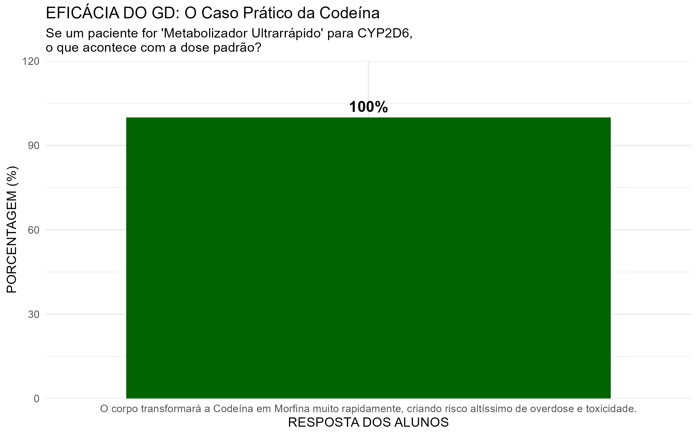

# Pharmacogenetics Nursing Education Analysis

> **Data-driven analysis of pharmacogenetics education impact. | A data analysis and educational impact project in pharmacogenetics for Nursing students (UFMG).**

🇧🇷 *[Read this in Portuguese](README.md)*

---

## ⌛ Project Status
> **Current Phase:** Phase 1 (Nursing Cohort) Completed ✅
> *The data pipeline (ETL), comparative analysis (Pre vs. Post), and visualization exports were successfully finalized. The repository remains active for future methodological expansion with new Nursing cohorts and potential inclusion of Pharmacy students.*

---

This project aims to assess Nursing students' knowledge of pharmacogenetics and measure the impact of an educational intervention based on clinical data, using a structured data analysis and descriptive statistics approach.

## 📌 Objective
To identify and analyze, through data, gaps in academic training regarding genetics and pharmacogenetics, quantitatively assessing whether a structured educational intervention improves students' understanding of patient safety and clinical decision-making.

## ⚠️ The Problem (Based on Scientific Literature)
Recent studies indicate that nurses have low confidence in interpreting genetic tests and applying pharmacogenetics in clinical practice. Traditional academic training still offers little preparation for these essential precision medicine concepts, which can directly impact patient safety at the bedside.

> *Source: Bibliographic analysis of 17 scientific articles ([see /docs folder](./docs)).*

## 🏆 Main Results (Data Insights - Phase 1)
Data extraction and analysis following the educational intervention revealed a clear disruption of common misconceptions and high retention of clinical safety practices:

* **Breaking the "Package Insert" Myth:** The belief that "strictly following the package insert (bula) prevents intoxication" dropped significantly, shifting to a total disagreement rate of **48.3%** in the post-intervention assessment.

* **Paradigm Shift (Allergy vs. Metabolism):** The initial view that severe reactions to the first dose are almost always "allergies" was reversed, with the majority of the cohort disagreeing with this premise after the educational intervention.

* **Practical Clinical Retention:** **100%** of students correctly identified the fatal risk of overdose in the practical case of ultra-rapid metabolism for Codeine (CYP2D6), and **93.1%** correctly determined the drastic dose reduction required in the TPMT deficiency case.

  
  

## 🛠️ Tech Stack and Tools
This project uses data-driven statistical programming to extract insights directly from questionnaires:
* **Data Collection:** Google Forms (Structured Likert-scale questionnaires).
* **Main Language:** `R`
* **Data Cleaning and Manipulation:** `dplyr` / `tidyr` (`tidyverse` package for data joining, variable renaming, and factoring).
* **Data Visualization:** `ggplot2` (Static comparative charts with a focus on health storytelling and automated export via `ggsave` at 300 DPI).

## 📕 Methodology
The project follows a structured educational data analysis approach consisting of the following steps:
1. **Bibliographic Review:** Identification of competence gaps in genetics and pharmacogenetics in Nursing.
2. **Baseline Data Collection:** Structured questionnaire applied before the intervention ($n = 34$ participants).
3. **Educational Intervention (Lecture + GD):** An expository lecture delivered by the professor on pharmacogenetics fundamentals, followed by an active Group Discussion (GD) at the end of the semester (Module 3). The GD focused on the practical application of scientific articles, addressing patient safety and clinical decision-making.
4. **Post-Intervention Collection:** A new paired questionnaire applied after the educational intervention was fully completed ($n = 29$ participants).
5. **Impact Analysis:** Use of a unified R script to clean, cross-reference, and generate visualizations to demonstrate the evolution of the cohort's clinical reasoning.

## 🧱 Repository Structure
* [**`/docs`**](./docs): Bibliographic review, article excerpts, and intervention planning.
* [**`/data`**](./data): Anonymized `.csv` databases (Baseline and Post-intervention collected in May 2026).
* [**`/scripts`**](./scripts): Complete `R` code containing the unified ETL pipeline and graph generation.
* [**`/plots`**](./plots): Organized into structured subfolders:
  * [`/01_pre_intervencao`](./plots/01_pre_intervencao): Initial Exploratory Data Analysis (EDA).
  * [`/02_resultados_finais`](./plots/02_resultados_finais): Comparative and post-intervention retention charts.

## 🚀 Next Steps & Scalability
This project was designed to be sustainable, incremental, and easily replicable:
1. **Longitudinal Analysis in Nursing:** Applying the same pipeline to upcoming Nursing cohorts, allowing for long-term assessment of educational impact and expansion of the data sample.
2. **Multidisciplinary Expansion:** Future refactoring of the script to integrate and compare data from other healthcare programs (such as Pharmacy), mapping perception variability between different professional fields.

---
*Extension Project - UFMG 2025/26*

---

**By Inácio Vieira** *Nursing Student at the Federal University of Minas Gerais (UFMG) | Aspiring Health Data Analyst* [LinkedIn](https://www.linkedin.com/in/inaciosantosvieira/)
**Professor / Advisor:** Prof. Marcelo Rizzatti Luizon [Lattes](http://lattes.cnpq.br/1264026443614775)
