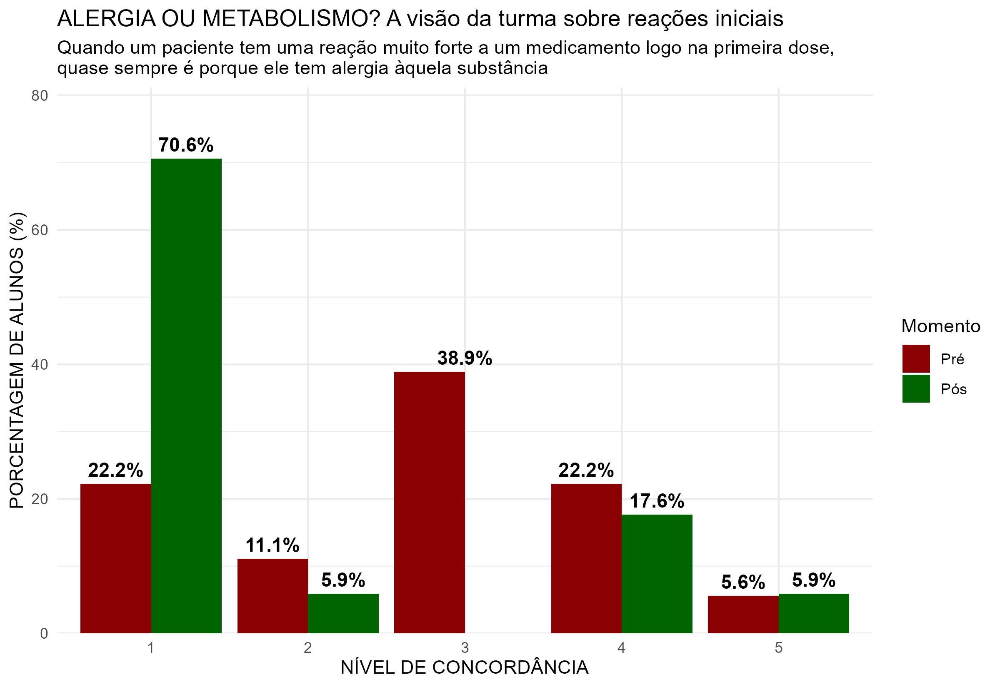
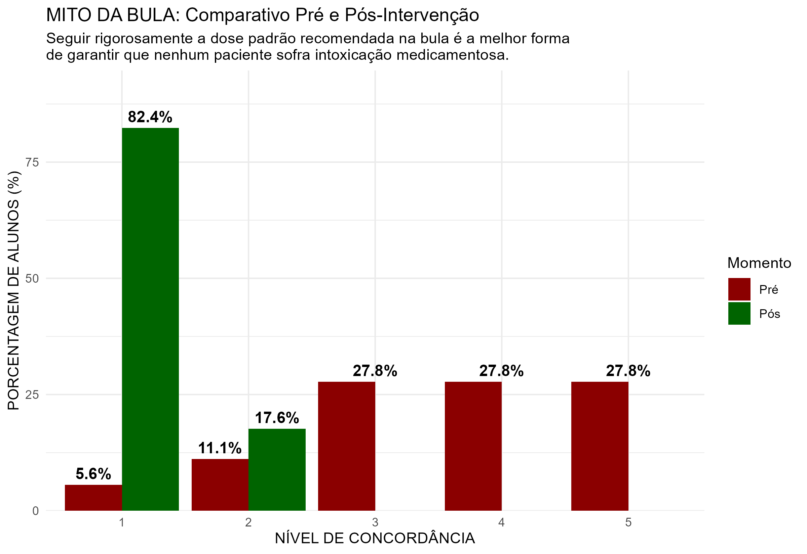
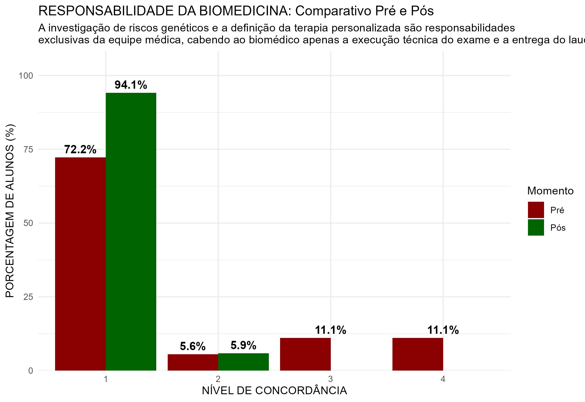

# Pharmacogenetics Health Education Analysis

> **Data-driven analysis of pharmacogenetics education impact. | Projeto de análise de dados e impacto educacional em farmacogenética para estudantes da área da saúde (UFMG).**

🇧🇷 *[Leia isso em Português](README.md)*

---

## ⌛ Project Status
> **Nursing (2026/1) ✅**
> *Pre-intervention survey application, Discussion Group (DG), post-intervention data collection, and comparative analysis successfully completed.*
>
> **Biomedicine (2026/1) ✅**
> *Pre and post-intervention data collection completed. Intervention performed solely with a Theoretical Lecture (no DG), acting as a methodological control group for the other cohorts.*
>
> **Pharmacy (2026/1) ⏳**
> *Baseline (Pre-intervention) data collection and analysis completed. Awaiting lecture application, DG, and post-intervention data collection.*

---

This project aims to assess health science students' knowledge of pharmacogenetics and measure the impact of educational interventions based on clinical data, using a structured approach of data analysis and descriptive statistics.

## 📌 Objective
Identify and analyze, through data, gaps in academic training regarding genetics and pharmacogenetics, quantitatively assessing whether an educational intervention improves students' understanding of patient safety and clinical decision-making.

## ⚠️ The Problem (Based on Scientific Literature)
Recent studies point out that the gap in precision medicine education is not an isolated issue, but a systemic flaw in the training of the entire multidisciplinary healthcare team. Nurses, pharmacists, and other professionals show low confidence in interpreting genetic tests and applying pharmacogenetics in practice. Traditional academic training still offers little preparation to handle this information, which directly impacts the prevention of adverse reactions and patient safety.

> *Source: Bibliographic analysis of 17 scientific articles ([see /docs folder](./docs)).*

## 🏆 Main Results (Data Insights - Phase 1: Nursing)
Data extraction and analysis after the complete educational intervention (Lecture + DG) revealed a clear breakdown of common sense myths and high retention of clinical safety protocols:

* **Breaking the Package Insert Myth:** Total agreement that "strictly following the package insert prevents intoxication" dropped drastically, giving way to a **48.3%** total disagreement in the post-intervention.

* **Paradigm Shift (Allergy vs. Metabolism):** The initial view that severe reactions on the first dose are always "allergies" was reversed, with the majority of the class disagreeing with this premise after the educational intervention.

* **Practical Clinical Retention:** **100%** of the students correctly identified the lethal risk of overdose in the practical case of Codeine ultra-rapid metabolism (CYP2D6), and **93.1%** got the required drastic dose reduction correct in the TPMT case.

  
  

## 🏆 Main Results (Data Insights - Phase 2: Biomedicine)
In the biomedicine cohort, the intervention was carried out exclusively through a **Theoretical Lecture** on pharmacogenetics, without the practical Discussion Group (DG). The data demonstrated that the theoretical baseline alone already has a massive statistical impact on correcting conceptual errors:

* **The End of the "Wall of Prudence":** At baseline, **38.9%** of the Biomedicine class opted for the "Neutral" level when asked if intoxications were always allergies. After the theoretical lecture, indecision plummeted to **0%**, with the vast majority (**70.6%**) assuming total disagreement.
 

* **Pulverization of the Package Insert Myth:** Confidence in the common sense that the "standard dose saves everyone" was eradicated. The class jumped from scattered responses to a solid block of **82.4%** total disagreement in the post-intervention.
  
  
* **Professional Empowerment:** Total disagreement that genetic risks are the "exclusive responsibility of the medical team" jumped from **72.2%** to **94.1%**, consolidating the biomedical scientist's understanding of the importance of their technical responsibility in lab reports.
   

### 📊 Preliminary Results (Baseline)
Currently, the Pharmacy cohort is the only one awaiting the final stage of the research (DG application and post-intervention data collection). The exclusive analysis of its baseline revealed an interesting contrast between theoretical mastery and practical decision-making:

* **Pharmacy:** Although students master the basic theory (100% correct in the pharmacogenetics concept), the class was divided when applying clinical reasoning in the Allergy vs. Metabolism scenario. Furthermore, **65.2%** of the students showed a strong dependence on common sense regarding the "Package Insert Myth" before receiving any intervention.

  
  

## 🛠️ Tech Stack and Tools
This project uses data-oriented statistical programming to extract insights directly from the surveys:
* **Data Collection:** Google Forms (Structured questionnaires with Likert scale).
* **Main Language:** `R`
* **Data Cleaning and Manipulation:** `dplyr` / `tidyr` (`tidyverse` package for joining datasets, renaming variables, and factoring).
* **Data Visualization:** `ggplot2` (Generation of static comparative charts focused on healthcare storytelling and automated export via `ggsave` in 300 DPI).

## 📕 Methodology
The project follows an educational data analysis approach composed of the following steps:
1. **Literature Review:** Analysis of scientific literature to identify knowledge gaps in genetics and pharmacogenetics among healthcare students and professionals.
2. **Data Collection (Baseline):** Structured survey before the intervention.
3. **Educational Intervention (Theoretical Lecture + DG):** A lecture given by the lead professor on the fundamentals of pharmacogenetics. In the Nursing and Pharmacy classes, the lecture is followed by a Discussion Group (DG) focused on applying real clinical cases. The Biomedicine class received only the theoretical lecture (methodological control group).
4. **Post-Intervention Data Collection:** A new survey for response pairing, applied after the educational intervention is completed.
5. **Impact Analysis:** Use of a unified R script to clean, cross-reference, and generate visualizations to assess changes in the cohorts' clinical reasoning.

## 🧱 Repository Structure
* [**`/docs`**](./docs): Literature review, article snippets, and intervention planning.
* [**`/data`**](./data): Anonymized `.csv` datasets separated by course.
* [**`/scripts`**](./scripts): Complete `R` code containing the unified ETL pipeline and chart generation.
* [**`/plots`**](./plots): High-resolution exported charts, organized by research phases.

## 🚀 Next Steps

1. Start the educational intervention in the Pharmacy class (Theoretical Lecture + DG).
2. Collect post-educational intervention data in the Pharmacy class.
3. Perform the Pre vs. Post comparative analysis for Pharmacy using the automated R pipeline.
4. Cross-reference analytical data from the three cohorts: Compare the effectiveness of clinical retention between groups that had a DG (Nursing and Pharmacy) versus the group that received only theoretical instruction (Biomedicine).

## ▶️ How to Run the Analysis (Total Portability)
This project was developed in a fully automated and structured way. To ensure relative paths work on your machine without you needing to change a single line of code, follow the professional standard for running R projects:

### 1. Download the Complete Project
Instead of downloading loose files, download the entire repository structure to keep the pipeline intact:
* Click the green **Code** button at the top of this page and select **Download ZIP** (then unzip the folder on your computer).

### 2. Open the Project in RStudio
Open your RStudio. In the top menu, go to File > New Project > Existing Directory.
Click Browse, navigate to the project folder you downloaded/unzipped, and click Create Project.

### 3. Run the Script Automatically
In the RStudio files tab, open the /scripts folder and select the file corresponding to the course you want to analyze (e.g., 05_pre_biomedicina.R).
Make sure the respective .csv database is inside the /data folder.

Press Ctrl + A to select all the code and click Run (or use the shortcut Ctrl + Enter).
The pipeline will execute the entire process autonomously:

- Raw data import and cleaning (ETL);
- Variable standardization and Likert scale factoring;
- Automated export of charts via `ggsave()`.

### Reproducibility and Scalability Notes
- Equivalent Structure: The scripts have strictly the same statistical logic, changing only the titles and specific questions adapted for the competencies of each professional category.
- No Code Alteration: If new cohorts or data are added to the project, you don't need to modify the code logic. Just replace the old file in the /data folder with a new .csv file of the same name and run the script again. The rest of the pipeline will remain unchanged.
  
---
*Extension Project - UFMG 2025/26*

---

**By Inácio Vieira** *Nursing Student at the Federal University of Minas Gerais (UFMG) | Starting in Healthcare Data Analysis* [LinkedIn](https://www.linkedin.com/in/inaciosantosvieira/)
**Advising Professor:** Prof. Marcelo Rizzatti Luizon [Lattes](http://lattes.cnpq.br/1264026443614775)
